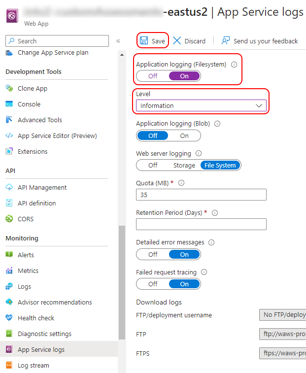

# Logging in Azure with Application Insights and Serilog

## Preface

In this article I will explore how Application Insights could be effectively used in a .NET application with Serilog,
and how to improve debugging and diagnosing experience with Azure specific logging capabilities. The goal is to show how to combine
the power of these tools and turn logging into an easy-to-use and powerful capability for any type of application. I will review
in detail different configuration options and code samples to achieve the best results for various use cases.

[Application Insights](https://learn.microsoft.com/en-us/azure/azure-monitor/app/app-insights-overview)
is a rich platform to collect and analyze application metrics and logs for various cloud and on-premises types of applications.

[Serilog](https://serilog.net/) implements 'structured logging', allowing to log messages and data in an easy-to-search format to various logging targets - 'sinks'.
With it, you can simultaneously write logs to Application Insights, local files, and any other required destination. The sinks are
fully configurable, and can be switched on and off at runtime depending on your needs.


## Configuring Application Insights

I will not dive deep in the configuration details, as there are many excellent guides how to configure Application Insights
from the very beginning. I will only emphasize the most important bits.

First, locate your Application Insights resource in the Azure portal. Its starting overview section will look similar to this:


The important information here is the Connection String - we will use it when setting up Application Insights access in code.
If we click the 'JSON view' link on the right, it will show all configuration details as a JSON representation.

Copy the Connection String - it should be stored in your application configuration. It can be stored as APPLICATIONINSIGHTS_CONNECTION_STRING
environment variable, or you can store it in any other available configuration source, such as JSON files
and Azure key vaults as "ApplicationInsights:ConnectionString" parameter.

Please note that you do not need to use the instrumentation key, as it is included in a connection string, and configuring
Application Insights in code using the instrumentation key is about to get deprecated by Microsoft. And please do note that
you should treat it as a secret - do not expose to untrusted parties and do not commit to a source control.


## Accessing Application Insights logs

Working with the information, logs, and metrics stored in Application Insights goes a bit beyond the scope I want to cover.
Thus, only a brief note here. Each App Service and Function in Azure has an Application Insights section that should give
you access to stored data. As well, you can directly access your Application Insights resource.

The overview dashboard will give quick general stats - failures, requests, etc. Under 'Monitoring - Logs' section it is possible
to query all stored data using tables, queries, and functions provided by Application Insights.

Overall, Application Insights is a powerful tool for a complete and thorough insight (pun intended!) into the workings
of your application, you just need to send the data that should really be logged. This is what we are going to cover next.

Just one more note - when using the dashboard or queries, we need to consider that all sent data becomes available with some
delay depending on what telemetry channel an application uses. There is also a way to see the logged data almost in real time -
we will cover it next, though it works only for Azure hosted applications.


## Using Azure Log Stream

Azure provides a way to see application logs almost immediately via a Log Stream. It allows to stream logs written into
files stored on Azure filesystem or to Azure blob. This feature is not designed to be always on, and when you
enable filesystem application logging it would turn off automatically in 12 hours.



When it is enabled and properly set up in code, it allows to see application logs almost in real time, as the information
gets logged, in the format it is logged. You can access it under the 'Log Stream' section. For example:


This feature can be quite useful for debugging and diagnosing.


## Preparing a project

### Adding nuget packages - a favorite part of any tutorial :)

Ok, let's start coding. For those striving for results here is a link to repository with the full code sample:
https://github.com/dmitry-slabko/article-azure-logging-pub

Meanwhile, let's add what we shall need.

#### Packages to add for Application Insights support:

- Microsoft.ApplicationInsights.AspNetCore - SDK and Auto Collectors for ASP.NET Core applications
- Microsoft.ApplicationInsights.WorkerService - SDK and Auto Collectors for Worker Service or Console applications
- Microsoft.ApplicationInsights - base SDK; Auto Collectors can be installed or implemented additionally
- Microsoft.ApplicationInsights.WindowsServer.TelemetryChannel - for a more reliable telemetry delivery
- Microsoft.Extensions.Logging.ApplicationInsights - log provider for Application Insights

Application Insights [GitHub page](https://github.com/Microsoft/ApplicationInsights-dotnet) contains great documentation about what package should be installed for various
scenarios. And it is always a good idea to use the latest package versions, and upgrade when a new version is released.


> **Note on the telemetry channels**
>
> The default Application Insight SDK provides an in-memory channel that is best suited for short running applications,
and it does not guarantee telemetry delivery in case of network failures or premature application termination. All data
is stored in memory, and delivered as soon as either of these thresholds is reached: every 30 seconds or 500 telemetry messages stored.
>
> The telemetry channel provided by Microsoft.ApplicationInsights.WindowsServer.TelemetryChannel package implements various
ways of attempting to ensure delivery - such as retries and storing messages on disk. This channel is more suited
for server scenarios or otherwise long-running applications.
>
> All telemetry channels provide a Flush method to attempt sending all remaining telemetry messages. The default in memory
channel implements this method in a synchronous way: the method will exit only when it had completed sending all remaining data.
>
> The server telemetry channel implements the Flush method asynchronously - it exits immediately, and there is no guaranteed
way to assert that all telemetry messages have been delivered. Microsoft suggests implementing a 'sufficient delay' after
calling this method and before allowing the application to terminate. However, some remaining telemetry messages may be lost
due to generally unpredictable nature of application termination process.


#### Serilog packages to add:

- Serilog - base package
- Serilog.AspNetCore - for ASP.NET Core
- Serilog.Exceptions - for improved exception logging
- Serilog.Extensions.Logging - a Serilog provider for Microsoft.Extensions.Logging
- Serilog.Extensions.Logging.ApplicationInsights - simplifies Application Insights configuration for Serilog
- Serilog.Sinks.ApplicationInsights - adds a Serilog sink to write logs to Application Insights
- Serilog.Expressions - for improved configuration capabilities via config files (an embeddable mini-language for filtering,
  enriching, and formatting Serilog events, ideal for use with JSON or XML configuration)
- Serilog.Settings.Configuration - Microsoft.Extensions.Configuration (appsettings.json) support for Serilog
- Serilog.Extensions.Hosting - to create a bootstrap logger

Enriching log events with additional data:
- Serilog.Enrichers.CorrelationId - add correlation id
- Serilog.Enrichers.Sensitive - automatically mask sensitive data

Additional sinks for other logging targets:
- Serilog.Sinks.Async
- Serilog.Sinks.Console
- Serilog.Sinks.File

There are many Serilog packages to extend and improve logging capabilities which you may want to use.


#### Other packages

- Microsoft.Azure.AppConfiguration.AspNetCore - use Azure App Configuration (for Azure hosted app)
- Microsoft.Extensions.Logging.AzureAppServices - custom log provider for Azure (for Azure hosted app)
- Microsoft.AspNetCore.HeaderPropagation - configure request header propagation (for web app / service)


## Configure Application Insights and Serilog in a .NET project

After we have installed the required packages, let's wire up Application Insights, Serilog, and other Azure components.

Generally speaking, we would need to register Application Insights telemetry services, wire up Serilog logging sinks,
and extend and fine tune this configuration with additional functionality.

First, let's prepare the application configuration. We need to make sure we have the Application Insights connection
string in a proper place - either in the environment variable or in one of the configuration sources, stored as
"ApplicationInsights:ConnectionString". If we implement an Azure hosted application, we should also add Azure configuration
sources.

This part of code looks very simple:
```csharp
builder.Services.AddApplicationInsightsTelemetry();
builder.Services.AddAzureAppConfiguration();
```
This code will enable Application Insights telemetry collection and build a TelemetryConfiguration instance with the connection
string we configured before. The method also registers a singleton of IOptions&lt;TelemetryConfiguration&gt; that can be resolved
from an IServiceProvider.

Then, let's start wiring up the logging. The best place to do that would be calls to these extenstion methods of an IHostBuilder:
IHostBuilder.ConfigureLogging and IHostBuilder.UseSerilog which we can add straight after the previous calls.

The ConfigureLogging method allows to use ILoggingBuilder to build up the logging configuration. Here is an example we could use:
```csharp
builder.Host.ConfigureLogging(logging => {
    logging.ClearProviders();
    logging.AddAzureWebAppDiagnostics();
});
```

Some notes on these methods. The ClearProviders method call is not necessarily required but can help maintain only those logging
providers we want to use. So, clearing the default providers would remove Console and Debug logging providers which a production
environment does not need.

The AddAzureWebAppDiagnostics method call registers Azure Web App diagnostic logger; it should be used if we want to use
Azure Log Stream.

Then we should start building up our Serilog setup. The best way is to use the extension method UseSerilog:
```csharp
builder.Host.UseSerilog(setupLoggerAction, writeToProviders: false); 
```

We will come to the logger setup action in just a moment, but first an important note on the writeToProviders parameter.
Its default value is false, so we can simply omit it. And the best choice is to keep it false - Serilog uses 'sinks' to
write log events, and these sinks should be explicitly configured in code or in configuration sources. Setting writeToProviders
parameter to true will enforce sending all log events to all registered logging providers, even if there is no
Serilog sink configured for a logging provider. While this may be useful in some situations, it will also cause duplicate
log events when we have a sink configured. So, unless you really want to go the 'blind' way and do not configure any
Serilog sinks and implicitly write the logs into all currently registered logging providers, keep this parameter at its
default value. Using explicitly configured Serilog sinks gives multiple advantages of fine-grained control of what and how gets logged.

Now let's explore the Serilog setup action:
```csharp
private static void SetupLoggerConfiguration(HostBuilderContext context, IServiceProvider provider, LoggerConfiguration loggerConfiguration) {
    var options = provider.GetRequiredService<IOptions<LogConfigOptions>>().Value;
    // LogConfigOptions is a home-brew configuration class for high-level logging setup

    loggerConfiguration
        .Enrich.FromLogContext()
        .Enrich.WithCorrelationIdHeader("x-correlation-id")
        .Enrich.WithExceptionDetails();

    if (options.HttpRequestLogging) {
        // this line is required 'as is' in order to enable HTTP request logging;
        // see more here: https://github.com/serilog/serilog-aspnetcore#request-logging
        loggerConfiguration.MinimumLevel.Override("Microsoft.AspNetCore", LogEventLevel.Warning);
    }
    
    var readerOptions = new ConfigurationReaderOptions {
        SectionName = options.ConfigurationSectionName
    };
    loggerConfiguration
        .ReadFrom.Configuration(context.Configuration, readerOptions)
        .ReadFrom.Services(provider);
    
    // Configure Application Insights sink
    var telemetryConfiguration = provider.GetService<IOptions<TelemetryConfiguration>>();
    if (!string.IsNullOrEmpty(telemetryConfiguration?.Value.ConnectionString)) {
        // We have a valid Application Insights setup
        loggerConfiguration
            .WriteTo
            .ApplicationInsights(telemetryConfiguration.Value, TelemetryConverter.Traces);
    }
    
    // Configure Azure log stream sink
    if (options.LogToAzureFileSystem && !context.HostingEnvironment.IsDevelopment()) {
        loggerConfiguration
            .WriteTo
            .Async(x => x.File(
                $@"D:\home\LogFiles\Application\{context.HostingEnvironment.ApplicationName}.txt",
                shared: true,
                flushToDiskInterval: TimeSpan.FromSeconds(1)
            ));
    }
}
```

And let's walk though the important bits and pieces of this code. First, LogConfigOptions class is an imaginary logging options
class we may want to use to control the high level aspects of our logging setup, such as if we want to log to Azure Log Stream, etc.


#### Enriching log events

We can 'enrich' our logs with more details - loggerConfiguration.Enrich.* calls. Serilog log 'enrichment' allows to add
custom data to every logged event implicitly, without submitting this data with logging calls, as we may not have this data
available at the logging site. For example, the correlation id enricher adds the correlation id request header value to each
log event which can be very useful in tracking a single operation across multiple log events and event log targets.

The exception details enricher adds more information to all logged exceptions, such as their custom properties, etc. Another
useful log enricher is Serilog.Enrichers.Sensitive - apply its WithSensitiveDataMasking() extension method to mask potentially
sensitive data in logs.

Serilog wiki contains good starting documentation on log enrichment: https://github.com/serilog/serilog/wiki/Enrichment, and I will
cover this feature in more details later.


#### Configuring Serilog from application configuration and other sources

```csharp
var readerOptions = new ConfigurationReaderOptions {
    SectionName = options.ConfigurationSectionName
};
loggerConfiguration.ReadFrom.Configuration(context.Configuration, readerOptions);
```
This code reads Serilog configuration from registered configuration sources under the specified section name. Serilog can be
fully configured using its JSON configuration (an example of such configuration is provided with the sample project),
however we can use additional options:
```csharp
loggerConfiguration.ReadFrom.Services(provider);
```
This will configure Serilog from the dependency container and apply a registered LoggingLevelSwitch and all registered implementations of:
ILoggerSettings, IDestructuringPolicy, ILogEventEnricher, ILogEventFilter, and ILogEventSink.

While it is a matter of personal preferences, having important logging setup aspects in code (versus JSON configuration)
makes the implementation more maintainable. We can add unit tests to explicitly cover them, and see the code coverage stats,
and good code is easier to read than JSON configurations.

In general, my personal preference is to configure Serilog for my local development environment in JSON (in appSettings.Development.json),
as this setup can come and go or be changed at a whim, and such whims should not affect production-ready code. Being production-ready
is like 'setting in stone' all the details, even for the logging setup.


#### Adding Application Insights sink

Let's review this code in detail:
```csharp
var telemetryConfiguration = provider.GetService<IOptions<TelemetryConfiguration>>();
if (!string.IsNullOrEmpty(telemetryConfiguration?.Value.ConnectionString)) {
    // We have a valid Application Insights setup
    loggerConfiguration
        .WriteTo
        .ApplicationInsights(telemetryConfiguration.Value, TelemetryConverter.Traces);
}
```

Since builder.Services.AddApplicationInsightsTelemetry() method call built and registered in the dependency container a
TelemetryConfiguration instance, we can reuse it here. First, to check if we have a valid Application Insights setup, and thus
can use the sink, and then we need this value to configure the sink.

The sink has another mandatory parameter - a telemetry converter. We have two converters out of the box - TelemetryConverter.Traces
and TelemetryConverter.Events. A telemetry converter is designed to format a log message and its parameters as a telemetry
record for Application Insights. These two converters submit a log message differently, but the whole log message gets to Application
Insights. When logging exceptions, the choice of converter does not matter, as a dedicated exception converter will always be used
for exceptions.

By default, trace telemetry submits:
- rendered message in trace's standard message property,
- severity in trace's standard severityLevel property,
- timestamp in trace's standard timestamp property,
- messageTemplate in customDimensions,
- custom log properties as customDimensions.

Event telemetry submits:
- message template as event name,
- renderedMessage in customDimensions,
- timestamp in event's standard timestamp property,
- custom log properties as customDimensions.

Exception telemetry submits:
- exception as standard Application Insights exception,
- severity in trace's standard severityLevel property,
- timestamp in trace's standard timestamp property,
- custom log properties as customDimensions.

Generally speaking, the trace converter creates Application Insights entries that are easier to read and analyze, but that
depends on the requirements and preferences, as usual.

There is the third optional parameter for the sink configuration: 'LogEventLevel restrictedToMinimumLevel' which by default is
set to LogEventLevel.Verbose, and which allows to skip any log event that has a lower level than this parameter. Please
note that this is different from the configured log level. For example, Serilog may be configured to log all events with the level of
Debug and higher, but the sink may allow the events with the level of Warning and above. This will cause the Application Insights
sink to log only Warning level events, or higher, while other sinks may submit Debug and Information log events.

And there is the fourth optional parameter: 'LoggingLevelSwitch levelSwitch' with the default value of null. If specified, it allows
to dynamically adjust allowed log levels for the sink.


#### Adding Azure Log Stream sink

And now we have this code to examine:
```csharp
(options.LogToAzureFileSystem && !context.HostingEnvironment.IsDevelopment()) {
    loggerConfiguration
        .WriteTo
        .Async(x => x.File(
            $@"D:\home\LogFiles\Application\{context.HostingEnvironment.ApplicationName}.txt",
            shared: true,
            flushToDiskInterval: TimeSpan.FromSeconds(1)
        ));
}
```

Let's also review it in details. Since logging to Azure Log Stream is more like a debugging and diagnosing tool, in normal
production scenarios we do not need to keep it enabled. Also, it may not work properly in a local development environment, as
it requires writing the log data into a specific location on the filesystem: 'D:\home\LogFiles\Application' folder.
Azure Log Stream will pick up any file in that folder and steam it to the log stream console, if enabled.

So, what we are doing here is configuring a regular Serilog file sink that would write the log events into a given file.
We also wrap the file sink into an async sink to avoid potential delays on file operations.
> Please note that many other Serilog sinks already implement asynchronicity, such as Application Insights sink,
> or do not need it, such as Console sink.

The are two parameters for the file sink particularly important in Azure Log Stream scenario: 'shared' and 'flushToDiskInterval'.
The shared parameter should be set to true, and the flushToDiskInterval parameter should be set to a relatively small value
to allow streaming log events in nigh real-time fashion.

The file sink has much more parameters which we may leave to their default values. However, we can fine tune the sink a little
more to better suit the Azure Log Stream scenario:
- fileSizeLimitBytes - limits how much data can be stored in a single log file; the default value is null which means no limit.
  Azure Log Stream has a quota on the filesystem storage, so it would make sense to set this limit. Also, since we would not use
  these log files for any other purpose, this value can be rather small - such as 1 to 4 MB.
- rollOnFileSizeLimit - a boolean value to specify if Serilog would rename a log file upon reaching the size limit before creating
  a new log file. The default value is 'false'. We can keep it false. The other two parameters take effect if we decide to enable
  the roll over.
- retainedFileCountLimit - how many log files would be retained if the roll over is enabled. If we enable the roll over,
  this value specifies how many files are kept after rolling over. The default value is 31, and considering the quota it is too
  large - best to set it to a smaller value, not larger than 3.
- retainedFileTimeLimit - a TimeSpan value defining how long a file can be retained. A file would be deleted on whatever condition occurs
  sooner - exceeding the retained file count or the time limit. The default value is to keep the files forever. Again, considering
  the Azure Log Stream scenario, if we enable retaining log files this value should be set to a few hours only, best not exceeding
  24 hours.

File sink may also be further customized by restrictedToMinimumLevel and levelSwitch parameters in the same way as
Application Insights sink.


#### Using Serilog logger

Serilog defines a non-generic interface, ILogger, which can be injected as a dependency since Serilog registers it in the dependency
container. An ILogger instance can be used for logging data. We can also use the static class Log provided by Serilog. Both
Log and ILogger provide the same methods for logging.


#### Further steps

So, by this moment we prepared all required configuration to use Application Insights and Serilog, and our code can use
Serilog to submit log events into Application Insights and any other log targets we may have configured.

There are a few advanced topics such as HTTP request logging and distributed logging which we should cover in the later chapters.


## Logging HTTP request details

Serilog provides a feature to log request details which writes cleaner and more useful logs for HTTP requests:
> The default request logging implemented by ASP.NET Core is noisy, with multiple events emitted per request.
> The included middleware condenses these into a single event that carries method, path, status code, and timing information.

So, in order to enable this feature we need to add two lines to our code. One of them is already added in our setup code:
```csharp
loggerConfiguration.MinimumLevel.Override("Microsoft.AspNetCore", LogEventLevel.Warning);
```

Let's add the other:
```csharp
app.UseSerilogRequestLogging(); // app is an IApplicationBuilder
```
This method will register the request logging middleware, and thus should be called early, before registering other middleware
and handlers such as MVC, otherwise it will not be able to log them. Also, this method can take a configuration action:
```csharp
var logOptions = app.ApplicationServices.GetRequiredService<IOptions<LogConfigOptions>>().Value;
// LogConfigOptions is a home-brew configuration class for high-level logging setup

if (logOptions.HttpRequestLogging) {
    app.UseSerilogRequestLogging(options => {
        options.GetLevel = (_, _, _) => logOptions.HttpRequestLogLevel;
    
        options.EnrichDiagnosticContext = (diagnosticContext, httpContext) => {
            foreach (var filler in httpContext.RequestServices.GetServices<IDiagnosticContextItem>()) {
                var data = filler.GetData(httpContext);
                if (data is not null) {
                    diagnosticContext.Set(filler.Key, data, destructureObjects: true);
                }
            }
        };
    });
    
    app.UseMiddleware<RequestBodyLoggingMiddleware>();
}
```

Again, let's review this code in detail. The configuration action has a parameter of type RequestLoggingOptions to customize
the request logging pipeline. Its GetLevel property is a function that takes three parameters and returns a LogEventLevel value:
- HttpContext instance for the current request;
- the number of elapsed milliseconds when handling the request;
- an Exception if one was thrown.

The default behavior returns LogEventLevel.Error when the response status code is 500 or greater, or if the exception is not null. However,
in this code the logging level is set to a configured value for all requests - mostly as an example. Normally, logging request details is
a debugging/diagnosing feature. However, this depends on the requirements, and some applications will require logging all requests
with full details.

EnrichDiagnosticContext function allows to add custom information to request logs. It receives two parameters: the current request
HttpContext instance and an IDiagnosticContext instance with two methods, Set and SetException, to inject additional data.
Set method takes three parameters - log property name, its value as an object, and an optional destructureObjects parameter
(false by default) to control logging of structured data.

This code sample uses an imaginary interface, IDiagnosticContextItem, that would work as a provider for such additional data
when logging requests.

### Request body logging

We have set up Serilog to log HTTP requests in a convenient and easy-to-process way. However, Serilog would not log request body,
and it may be critical for debugging purposes.

Now let's review RequestBodyLoggingMiddleware sample implementation which should do exactly that - log request body.
```csharp
public sealed class RequestBodyLoggingMiddleware {
    private readonly RequestDelegate next;
    
    public RequestBodyLoggingMiddleware(RequestDelegate next) {
        this.next = next;
    }
    
    public async Task InvokeAsync(HttpContext context, IOptions<LogConfigOptions> logOptions) {
        if (logOptions.Value.HttpRequestLogging && (context.Request.Method == HttpMethod.Post.Method
            || context.Request.Method == HttpMethod.Put.Method || context.Request.Method == HttpMethod.Patch.Method)) {
            string body = await TryGetRequestData(context.Request);
            if (!string.IsNullOrEmpty(body)) {
                var bodyLogger = context.RequestServices.GetRequiredService<RequestBodyDiagnosticItem>();
                bodyLogger.ProvideRequestBody(body);
            }
        }
    
        await next(context);
    }
    
    private static async ValueTask<string> TryGetRequestData(HttpRequest request) {
        if (request.ContentLength.GetValueOrDefault() == 0) {
            return "";
        }
    
        if (request.HasFormContentType) {
            return ReadFormData(request.Form);
        }
    
        return await ReadBodyAsync(request);
    }
    
    private static async ValueTask<string> ReadBodyAsync(HttpRequest request) {
        if (!request.Body.CanSeek) {
            request.EnableBuffering();
        }
    
        using var streamReader = new StreamReader(request.Body, leaveOpen: true);
        string body = await streamReader.ReadToEndAsync();
        request.Body.Position = 0;
        return body;
    }
    
    private static string ReadFormData(IFormCollection form) { ... }
}
```

This code is quite self-explanatory. However, let's point to a few aspects. Some HTTP request methods, such as GET, do not
contain a body. We should as well exclude TRACE, OPTIONS, and HEAD methods. Some API implementations may expect a body on
DELETE requests. However, it is not advisable to pass a body with DELETE requests, and this method can be safely excluded as well.
Other methods - PUT, POST, PATCH - often contain a body, and we will want to log it.

The middleware attempts to extract the body data from either a request body or a submitted form. When reading the body stream,
we need to enable its buffering to rewind it to the starting position for normal request processing. Parsing the form data
is omitted for brevity - it is available in the sample repository (see links at the end).

There are many additional considerations to make when logging request body, such as how much we would want or need to log for
large bodies, sanitizing logged data for PI and other sensitive information, excluding binary data, etc. So, this middleware
is a sample only, and not really production-ready, unless being applied for simplest use cases. However, it can be fine-tuned
for particular scenarios.

And let's explore RequestBodyDiagnosticItem class and its uses. It should implement the aforementioned IDiagnosticContextItem
interface, and be properly registered in the dependency container:
```csharp
public sealed class RequestBodyDiagnosticItem : IDiagnosticContextItem {
    private string requestBody = "";

    public void ProvideRequestBody(string body) {
        requestBody = body;
    }
    
    public string Key => "Body";
    public object GetData(HttpContext context) => requestBody;
}

// And its registration:
services
    .AddScoped<RequestBodyDiagnosticItem>()
    .AddTransient<IDiagnosticContextItem>(provider => provider.GetRequiredService<RequestBodyDiagnosticItem>());
```

In a similar manner, we may provide yet more details for HTTP request logs. Let's review adding client IP and request headers.
```csharp
public sealed class RequestIpDiagnosticItem : IDiagnosticContextItem{
	public object GetData(HttpContext context) => context.Request.HttpContext.Connection.RemoteIpAddress ?? IPAddress.None;
	public string Key => "IP address";
}

public class RequestHeadersDiagnosticItem : IDiagnosticContextItem {
	public object GetData(HttpContext context) => context.Request.Headers.ToArray();
	public string Key => "Headers";
}

// And their registration:
services
    .AddTransient<IDiagnosticContextItem, RequestHeadersDiagnosticItem>()
    .AddTransient<IDiagnosticContextItem, RequestIpDiagnosticItem>();
```

Please note that these two classes are registered as 'transient' - their instances will not be stored in the dependency container.
They do not maintain any state, only provide logic, unlike RequestBodyDiagnosticItem implementation which stores state during a request lifetime.

Let's see how these extra pieces look in the logged data in Application Insights:


The request data is stored in 'customDimensions' object in a trace, and under it we see the data logged by Serilog request logging middleware
together with the custom data we added - 'Headers' and 'IP address'; this request did not have a body, so we do not see it here.

If we expand headers, we will see their values:


Please note the 'apikey' header - this is a secret value, that should not be logged. We would need to implement sanitizing logged data
if we want to log headers and they contain sensitive information.

So, by now we have improved our logs with HTTP request details in quite a complete way.


## Enriching logs with custom information

Serilog has an interesting concept and implementation of 'log enrichers' which they describe as 'log events can be enriched
with properties in various ways'. We have already added some pre-built enrichers in our logging setup:
```csharp
loggerConfiguration
    .Enrich.FromLogContext()
    .Enrich.WithCorrelationIdHeader(HeaderKeyNames.CorrelationId)
    .Enrich.WithExceptionDetails();
```

The log context enricher allows to use a 'logging context' where custom properties can be added to and removed from. It provides
disposable objects that get appended to log events until they are disposed.

Serilog comes packed with many various log enrichers, I will not review most of them here. We will look at the correlation id
in a chapter about the distributed logging. Now, I would like to give an overview of the concept because it provides a nice way
of decoupling business and application code from logging concerns.

Let's take as an example logging some currently authenticated user information with each log event.
> Note: logging user information is a sensitive matter, and we should be rather cautious here, and log it in a very impersonal
> manner. Probably, the best way would be to log an id - not a name or an email address.

Often, we would deal with a bearer token containing the user information, so it could be the source of the user id
in our example. Let's dig into code again:
```csharp
public sealed class UserIdEnricher : ILogEventEnricher {
    private const string UserIdPropertyName = "UserId";
    
    private readonly IHttpContextAccessor contextAccessor;
    
    public UserIdEnricher(IHttpContextAccessor contextAccessor) {
        this.contextAccessor = contextAccessor;
    }
    
    void ILogEventEnricher.Enrich(LogEvent logEvent, ILogEventPropertyFactory propertyFactory) {
        if (contextAccessor.HttpContext == null) {
            return;
        }
    
        int? userId = ... // logic to extract the id; the id may as well be a string or a GUID
    
        if (userId.HasValue) {
            var property = new LogEventProperty(UserIdPropertyName, new ScalarValue(userId));
            logEvent.AddOrUpdateProperty(property);
        }
    }
}
```

We have a class that implements a Serilog interface, ILogEventEnricher. Its Enrich method is called by Serilog to enrich
a log event with the data we extract from our bearer token from the current HttpContext. We just need to properly register
this class during logging configuration:

```csharp
loggerConfiguration.Enrich.With<UserIdEnricher>(); // loggerConfiguration is a Serilog.LoggerConfiguration instance
```

Regular dependency container logic will take care of injecting our constructor dependencies (IHttpContextAccessor). We can also
take advantage of the logging setup code we have implemented, namely of this piece:
```csharp
loggerConfiguration.ReadFrom.Services(provider);
```

And simply register our custom log enricher in the dependency container:
```csharp
services.AddScoped<ILogEventEnricher, UserIdEnricher>();
```

The 'ReadFrom.Services' call would use all registered ILogEventEnricher implementations - just as simple as that. No other code
is required to add a user id to log events.

So, what implementing log enrichers would give and how may it be applied? The first thing to mention is that neither business
logic code, nor application code is designed to _produce logs_; it has a completely different purpose. The less logging code
we have inside our business and application code, the cleaner, less coupled, and more cohesive our code is. Those working with
enterprise code are quite used to code 'spiced up' with logging statements. While 'what and when' to log and 'what and when'
not to log is a matter of non-ending debates and particular scenarios and requirements, writing clean code is always a goal.

Serilog enrichers are a way of abstracting away collecting and providing custom data for logs, and thus contribute to cleaner
code. Often some piece of data is not available at a code location where we want to write a log event, and it would either need
to be injected as a dependency or some kind of 'provider' should in place to feed it into logs. An opposite case is also quite
typical: we produce data that should or may be logged somewhere down the pipeline. So, now let's review a sample implementation
designed to solve this problem.

```csharp
public sealed class CustomLogEnricher : ILogEventEnricher {
    private readonly Dictionary<string, List<string>> properties = new();
    
    public CustomLogEnricher With(string property, string value) {
        if (string.IsNullOrWhiteSpace(value)) {
            return this;
        }
    
        if (properties.TryGetValue(property, out var values)) {
            values.Add(value);
        } else {
            properties.Add(property, new() { value });
        }
    
        return this;
    }
    
    void ILogEventEnricher.Enrich(LogEvent logEvent, ILogEventPropertyFactory propertyFactory) {
        foreach (var item in properties) {
            LogEventPropertyValue value = item.Value.Count == 1
                ? new ScalarValue(item.Value[0])
                : new SequenceValue(item.Value.Select(x => new ScalarValue(x)));
            logEvent.AddOrUpdateProperty(new LogEventProperty(item.Key, value));
        }
    }
}

// Its registration:
services
    .AddScoped<CustomLogEnricher>()
    .AddTransient<ILogEventEnricher>(provider => provider.GetRequiredService<CustomLogEnricher>());
```

This is a more generic implementation of a log enricher. It can be injected as a dependency, and we would call its With method to
provide custom data for log events. Again, this implementation is more a sample to demonstrate the concept of log enrichers than
a real production code. Unlike the LogContext enricher, which scope is limited by the lifetime of disposable objects (normally, within
a method or an instance), this enricher holds to data for its own lifetime.

It is also worth mentioning that when a log event is being written, only the currently accumulated custom data in log enrichers
will be applied to the log event. If we add more custom data after a log event was written, it will not get logged with that
event. Additionally, when writing a custom log enricher it is possible to filter the accumulated (or generated) data for a log
event based on LogEvent properties - its LogLevel, if it logs an exception - or based on any custom logic, including provided
by injected dependencies.

Log enrichers allow to write cleaner code and implement sophisticated logging logic with ease, their code is very easy to
cover with unit tests.


## Supporting distributed logging scenarios

Distributed operations, and thus distributed logging, are very common. One of the main problems of distributed logging is to
have and maintain a unique 'operation id' during the whole chain of distributed operations that from our point of view are a
single operation. For REST APIs and HTTP requests we normally would solve it by creating and maintaining a 'correlation id'
which would be passed as a request header for all requests serving a single operation.

Let's review how we can achieve this and get it properly logged in Application Insights with Serilog.

When we set up our logging configuration, we used a correlation id log enricher:
```csharp
loggerConfiguration.Enrich.WithCorrelationIdHeader("x-correlation-id");
```

Its task is very simple: take the specified header value and add it to log events. By default it would use 'x-correlation-id'
header. However, we need additional steps to make sure the same header with the same value will be carried over by all
outgoing requests we may make. ASP.NET Core provides the 'header propagation' feature that we are going to set up and use.

This code will enable services required to support header propagation:
```csharp
services.AddHeaderPropagation(x => {
    x.Headers.Add("x-correlation-id");
    x.Headers.Add("traceparent");
});
```

And if we use HttpClientFactory for outgoing request, we should also configure header propagation for the factory:
```csharp
services.AddHttpClient("name-of-http-client").AddHeaderPropagation();
```

This will allow to transfer all configured headers with their values from an incoming request to all outgoing requests made by
the specified HTTP clients.


### Application Insights concept of 'operation id'

When we look at logged events in Application Insights, they all have a property called 'operation_Id' which is serving exactly
this purpose - to join together logs for different operations into a single logical operation. There are a few ways to pass
an operation id to Application Insights, and we will review how to do it in a simple way for an ASP.NET Core application.

W3C has a standard called 'Trace Context' designed to solve the distributed tracing (logging) challenges, and Application Insights
fully supports it. We only need to properly create a 'traceparent' header value and send it with a request - Application Insights
will extract the operation id value from it and assign to all logged events. And since we configured header propagation to carry
over this header, it will naturally flow further if our application makes any outgoing requests.

The standard keeps changing, and now they are at 'Level 3'. Let's briefly review how to construct the value. It consists of four
parts separated by dashes:
- version,
- trace id,
- parent id,
- flags.

Currently, the version should always be "00". The 'trace id' field is our correlation or operation id, and it must contain 32 hexadecimal
lowercase characters. It should be used to uniquely identify the operation. The 'parent id' field must contain 16 hexadecimal lowercase
characters. As the standard describes this field, 'this is the id of this request as known by the caller'. However, for our
purposes we can simply generate it randomly.

The flags field defines two flags: FLAG_SAMPLED = 1 and FLAG_RANDOM = 2. Since we would normally generate this value randomly,
we should always set FLAG_RANDOM. The other flag, FLAG_SAMPLED, may be used by the caller to tell that it recorded the trace data on
its side. We can safely ignore this flag, as it changes nothing in Application Insights processing.

Below is a simple implementation of 'traceparent' value generator.
```csharp
public sealed class TraceContext {
    private const string Version = "00";
    
    private const int FlagSampled = 1;
    private const int FlagRandom = 2;
    
    private const int ParentIdLength = 16;
    private const int CorrelationIdLength = 32;
    
    private static readonly Random Rnd = new();
    
    private string? traceParentValue;
    
    public TraceContext() {
        var bytes = new byte[8];
        Rnd.NextBytes(bytes);
        ParentId = string.Concat(bytes.Select(b => b.ToString("x2")));
        CorrelationId = Guid.NewGuid().ToString("N");
    }
    
    public TraceContext(string parentId, string correlationId) {
        if (parentId.Length != ParentIdLength || !IsHexadecimal(parentId)) {
            throw new ArgumentException("Must contain a 16 hexadecimal lowercase characters string", nameof(parentId));
        }
    
        if (correlationId.Length != CorrelationIdLength || !IsHexadecimal(correlationId)) {
            throw new ArgumentException("Must contain a 32 hexadecimal lowercase characters string", nameof(correlationId));
        }
    
        ParentId = parentId;
        CorrelationId = correlationId;
    }
    
    public bool Sampled { get; set; } = false;
    public string ParentId { get; }
    public string CorrelationId { get; }

    public override string ToString() {
        if (traceParentValue is null) {
            var sb = new StringBuilder(Version, 55)
                .Append("-")
                .Append(CorrelationId)
                .Append("-")
                .Append(ParentId)
                .Append("-")
                .Append((FlagRandom | (Sampled ? FlagSampled : 0)).ToString("x2"));
    
            traceParentValue = sb.ToString();
        }
    
        return traceParentValue;
    }
    
    private static bool IsHexadecimal(ReadOnlySpan<char> span) {
        foreach (char c in span) {
            if (c is (< '0' or > '9') and (< 'a' or > 'f')) {
                return false;
            }
        }
    
        return true;
    }
}
```

So, if we generate a 'traceparent' value and pass it as a header to the first request in our operation chain, it will be picked
up by Application Insights automatically, and with the setup we made it will get carried over further, forming a unique logical
operation chain in our logs.

We may want to make a small adjustment: if we decide not to send 'x-correlation-id' header together with 'traceparent' header,
we should change the correlation id enricher configuration.
```csharp
loggerConfiguration.Enrich.WithCorrelationIdHeader("traceparent");
```


## Conclusion

At this moment we have a fully prepared solution to work with sophisticated logging scenarios that is capable of using
Serilog structural logging feature and submit the log events to Application Insights. And if we wish so, we can additionally
expand our logs with complete HTTP request information, enrich logs with custom data, support distributed logging scenarios,
and use Azure Log Stream if we need to have an immediate overview of what's going on inside of our application.

There are a few more features a production-ready logging solution would require, such as sanitizing the logged data (remember the API key
making it into the attached log sample?). However, that would require another large discussion which we shall leave for another
time. I would just hint to [SensitiveDataEnricher](https://github.com/serilog-contrib/Serilog.Enrichers.Sensitive) implementation,
as the log enrichers are also able to manipulate the data collected for submitting with log events. Of course, there are
other ways as well, such as pre-filtering HTTP request headers in our sample implementation.

Thank you for reading, and I hope it was useful!


## Links to used resources

General information on logging in .NET - https://learn.microsoft.com/en-us/aspnet/core/fundamentals/logging

Application Insights Overview - https://learn.microsoft.com/en-us/azure/azure-monitor/app/app-insights-overview

Telemetry channels in Application Insights - https://learn.microsoft.com/en-us/azure/azure-monitor/app/telemetry-channels

Serilog - https://serilog.net, https://github.com/serilog/serilog

On Azure log streams - https://learn.microsoft.com/en-us/azure/container-apps/log-streaming,
https://learn.microsoft.com/en-us/azure/azure-functions/streaming-logs,
https://learn.microsoft.com/en-us/azure/app-service/troubleshoot-diagnostic-logs

Serilog integration in ASP.NET Core - https://github.com/serilog/serilog-aspnetcore

Serilog enrichment - https://github.com/serilog/serilog/wiki/Enrichment

Serilog sinks - https://github.com/serilog/serilog/wiki/Provided-Sinks

Serilog with Application Insights - https://github.com/serilog-contrib/serilog-sinks-applicationinsights

General information about the dependency injection in .NET - https://learn.microsoft.com/en-us/dotnet/core/extensions/dependency-injection

On trace context - https://w3c.github.io/trace-context/#traceparent-header-field-values


## A short bio note

My name is Dmitrii Slabko, I am passionate about software development with a zest for tackling complex coding and architectural challenges,
I find immense joy in crafting clean, robust, concise, and effective code that can be easily comprehended by developers at all levels,
including juniors.

With over 25 years of experience encompassing the full life cycle of diverse software projects, I have devoted the last decade
and a half to honing my expertise in building cutting-edge web applications and application services using .NET.

As an ardent advocate of knowledge sharing, I actively serve as a mentor to aspiring software developers, imparting practical
insights into .NET, C#, and backend software development. Witnessing the growth and professional advancement of fellow developers
through my guidance is incredibly rewarding.

My linkedin profile: https://www.linkedin.com/in/dmitry-slabko

My recently re-initiated blog: https://blog.simplecode.dev